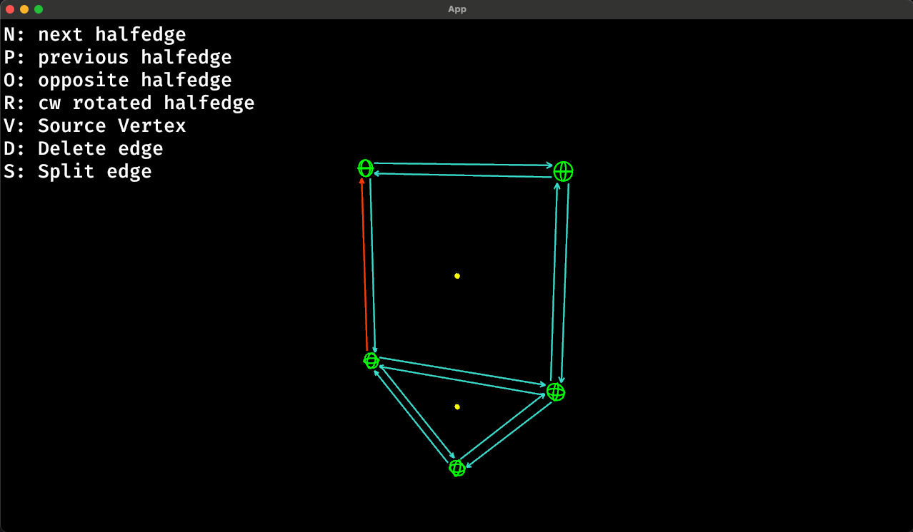

[](https://github.com/Bendzae/SMesh/actions/workflows/rust.yml)
[](https://crates.io/crates/smesh)

# SMesh
> [!CAUTION]
> Library is still work in progress

SMesh is a polygon mesh manipulation library based on the
[Surface Mesh](https://link.springer.com/chapter/10.1007/978-3-642-24734-7_29)
data structure and the [pmp](https://github.com/pmp-library/pmp-library)
library.

For now it is a rough port of the amazing
[pmp](https://github.com/pmp-library/pmp-library) library with a "rusty" api on
top, but I plan to add additional functionality. The libary uses a slotmap based
implementation of the Surface Mesh which takes heavy inspiration from
[blackjacks](https://github.com/setzer22/blackjack) halfedge-mesh
implementation.

### Examples


_use the visualizer example app to interactively explore library features_

`cargo run --example visualizer`

There is also an example for the bevy mesh integration:

`cargo run --example bevy_mesh`

### Usage

_Preface_: Mesh elements in SMesh are identified by a unique typesafe id, which can be of type:
`VertexId`, `HalfedgeId` and `FaceId`.

#### Mesh creation

SMesh has a simple api to add vertices to your mesh and connect them to faces:
_Add vertices_

```rust
    let mut smesh = SMesh::new();
    let v0 = smesh.add_vertex(vec3(-1.0, -1.0, 0.0)); // Returns a unique VertexId
    let v1 = smesh.add_vertex(vec3(1.0, -1.0, 0.0));
    let v2 = smesh.add_vertex(vec3(1.0, 1.0, 0.0));
    let v3 = smesh.add_vertex(vec3(-1.0, 1.0, 0.0));
```

_Build face_

```rust
    smesh.add_face(vec![v0, v1, v2, v3])?;
```

#### Mesh queries

SMesh provides a chainable api to query mesh elements using the typical halfedge-mesh relationships:

_get outgoing halfedge of a vertex_

```rust
let outgoing_halfedge_query = v0.halfedge(); // returns a MeshQueryBuilder<HalfedgeId>
```

_you can execute the query on a smesh instance by using `.run(&smesh)`_

```rust
let outgoing_halfedge = v0.halfedge().run(&smesh)?;  // returns a HalfedgeId
```

_chaining queries_

```rust
let vertex = v0.halfedge_to(v1).cw_rotated_neighbour().dst_vert().run(&smesh)?;  // returns a VertexId
```

#### Mesh operations

Coming soon...

Please check the examples for more :)

### Goals

I aim to provide a flexible rust implementation of the Surface Mesh with a focus
on usefulness for procedural mesh generation. Other goals are:

- Ergonomic and easy-to-use api
- Port most operations from the pmp library
- Support most operations that are possible in modern 3D modeling software like
  blender
- Integration with the bevy game engine
- Target manifold tri & quad meshes for now
